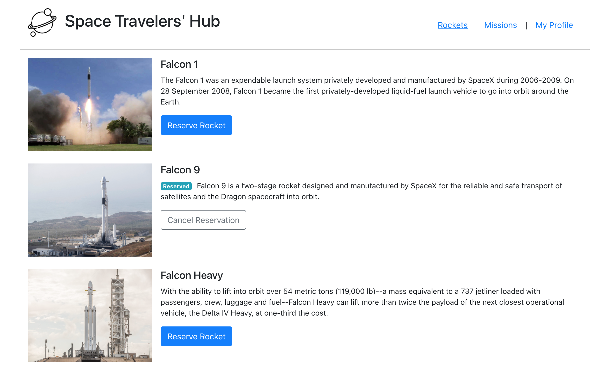

# Charles Gobina and Yuriy Chamkoriyski Space Travellers' Hub project

> React app

## Description

In this task, you will be working with the real live data from the SpaceX API. Your task is to build a web application for a company that provides commercial and scientific space travel services. The application will allow users to book rockets and join selected space missions.

## Requirements:

### Phase 1, config and basic setup
- [x] Create React App.
- [x] Install [React Redux](https://react-redux.js.org/), [Redux Logger](https://www.npmjs.com/package/redux-logger) and [React Router](https://v5.reactrouter.com/web/guides/quick-start).
- [x] Download the [free image](https://www.flaticon.com/free-icon/planet_3212567?term=space&page=1&position=19&page=1&position=19&related_id=3212567&origin=style) for the app logo.
- [x] Create routes and view components (Rockets, Missions, My Profile, Dragons [only if your team has 3 members]). Use `<NavLink />` for the page navigation links and style active class to indicate which section/page user is currently on (underline active navigation link).
- [x] Create directories for all Redux state slice files (rockets, missions, dragons [only if your team has 3 members]).

### Phase 2, Redux: Fetch data and update Redux store
- [x] Upon first render fetch data from the SpaceX API endpoints:
  - [x] Rockets: https://api.spacexdata.com/v3/rockets
  - [x] Missions: https://api.spacexdata.com/v3/missions
- [x] Once the data are fetched, dispatch an action to store the selected data in Redux store:
  - [x] Rockets:
    - [x] id
    - [x] rocket_name
    - [x] description
    - [x] flickr_images
  - [x] Missions:
    - [x] mission_id
    - [x] mission_name
    - [x] description

NOTE: Make sure you only dispatch those actions once and do not add data to store on every re-render (i.e. when changing views / using navigation).

NOTE: Rockets is the default view, so you must fetch rockets data when the application starts. However, the missions data should only be fetched (once) when a user navigates to the Missions section.

### Phase 3, Render UI:lists
- [x] Use useSelector() Redux Hook to select the state slices and render lists of rockets and missions in corresponding routes. i.e.:
`// get rockets data from the store
const rockets = useSelector(state => state.rockets);`
- [x] You can style the whole application "by hand" or you could use [React Bootstrap](https://react-bootstrap.github.io/), a UI library that could speed up the process. This is a popular library and working with its components would be good practice.
- [x] Render a list of rockets (as per design). For the image of a rocket use the first image in the array of `flickr_images`.
- [x] Render a table with the missions' data (as per design).

### Phase 4, Redux: Write actions and reducers for booking rockets and joining missions
- [x] When a user clicks the "Reserve rocket" button or "Reserve dragon" button [only if your team has 3 members], action needs to be dispatched to update the store. You need to get the ID of the reserved rocket and update the state. Remember you mustn't mutate the state. Instead, you need to return a new state object with all rockets, but the selected rocket will have an extra key `reserved` with its value set to `true`. You could use a JS `filter()` or `map()` to set the value of the new state - i.e.:

  `const newState = state.map(rocket => {` 
    &nbsp;&nbsp;&nbsp;&nbsp;`if(rocket.id !== id)` 
      &nbsp;&nbsp;&nbsp;&nbsp;&nbsp;&nbsp;&nbsp;&nbsp;`return rocket;` 
    &nbsp;&nbsp;&nbsp;&nbsp;`return { ...rocket, reserved: true };` 
  `});`

- [x] Regardless of which method you choose, make sure you place all your logic in the reducer. In the React view file, you should only dispatch the action with the correct rocket ID as an argument.
- [x] Create a reducer and action dispatcher for the "Join Mission" button. The logic here is practically the same as with rockets - you need to pass the mission's ID to the corresponding action and update the missions' state with the selected mission having a new key/value - `reserved: true`.

### Phase 5, Redux: Write actions and reducers for canceling rockets/dragons and leaving missions
- [x] Here you need to follow the same logic as with the "Reserve rocket"/"Reserve dragon" and "Join mission" - but you need to set the `reserved` key to `false`.
- [x] Dispatch these actions upon click on the corresponding buttons.

## Built With

- Major languages: Javascript
- Frameworks: React.js, Redux
- Technologies used: Node.js, Babel, Jest, webpack
- Tested with: - ESLint (JavaScript linting), Stylelint (style linting)

## Live Demo

No deployment yet.

### Prerequisites

- Internet connection and browser
- A text editor(preferably Visual Studio Code)
- Browser

### Setup

- This project was bootstrapped with [Create React App](https://github.com/facebook/create-react-app).

### Install

- [Git](https://git-scm.com/downloads)
- [Node](https://nodejs.org/en/download/)

### Usage

- Clone the repository using `git clone https://github.com/Hombre2014/space-travelers`
- Change directory into the project folder: `cd space-travelers`
- Run `npm install`
- Run `npm start`
- A new browser will open automatically with application loaded

## Available Scripts

In the project directory, you can run:

### `npm start`

Runs the app in the development mode.\
Open [http://localhost:3000](http://localhost:3000) to view it in your browser.

The page will reload when you make changes.\
You may also see any lint errors in the console.

### `npm test`

Launches the test runner in the interactive watch mode.\
See the section about [running tests](https://facebook.github.io/create-react-app/docs/running-tests) for more information.

### `npm run build`

Builds the app for production to the `build` folder.\
It correctly bundles React in production mode and optimizes the build for the best performance.

The build is minified and the filenames include the hashes.\
Your app is ready to be deployed!

See the section about [deployment](https://facebook.github.io/create-react-app/docs/deployment) for more information.

### `npm run eject`

**Note: this is a one-way operation. Once you `eject`, you can't go back!**

If you aren't satisfied with the build tool and configuration choices, you can `eject` at any time. This command will remove the single build dependency from your project.

Instead, it will copy all the configuration files and the transitive dependencies (webpack, Babel, ESLint, etc) right into your project so you have full control over them. All of the commands except `eject` will still work, but they will point to the copied scripts so you can tweak them. At this point you're on your own.

You don't have to ever use `eject`. The curated feature set is suitable for small and middle deployments, and you shouldn't feel obligated to use this feature. However we understand that this tool wouldn't be useful if you couldn't customize it when you are ready for it.

### Deployment

- Not ready yet.

## Authors

👤 **Charles Gobina**

- GitHub: [@charlesgobina](https://github.com/charlesgobina)
- Twitter: [@charles_gobina](https://twitter.com/charles_gobina)
- LinkedIn: [Charles Gobina](https://www.linkedin.com/in/charles-gobina-74a0ab193/)

👤 **Yuriy Chamkoriyski**

- GitHub: [@Hombre2014](https://github.com/Hombre2014)
- Twitter: [@Chamkoriyski](https://twitter.com/Chamkoriyski)
- LinkedIn: [axebit](https://linkedin.com/in/axebit)

## 🤝 Contributing

Contributions, issues, and feature requests are welcome!

Feel free to check the [issues page](https://github.com/Hombre2014/space-travelers/issues).

## Show your support

Give a ⭐️ if you like this project!

## Acknowledgments

## 📝 License

This project is [MIT](./license.md) licensed.